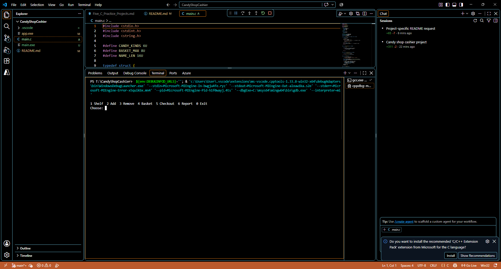
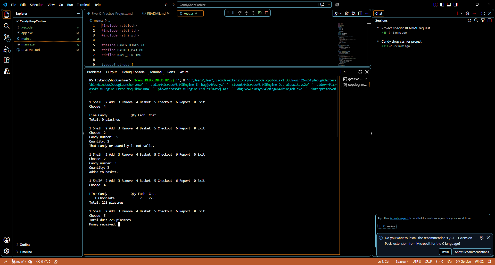
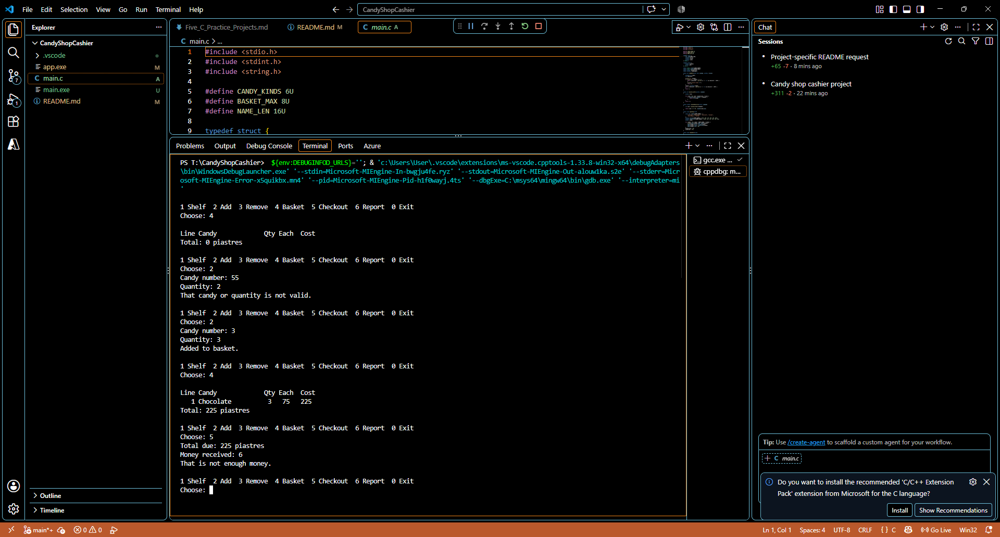

## name : Tasneem Hossam El-Din Hassan Salem

## email : tasneem.hossameldin@outlook.com

# Candy Shop Cashier

A console-based candy shop cashier written in C. The program manages a small
candy shelf, builds a customer basket, accepts payment, gives change, and
prints an end-of-day sales report.

## Features

- View candy names, prices, and available stock.
- Add multiple quantities of candy to a basket.
- Remove basket lines before checkout.
- Reject invalid quantities and purchases above available stock.
- Complete sales and update stock, sold quantities, and the cash drawer.
- Report total candies sold, money in the drawer, the best seller, and sold-out
	candy.

## Candy Inventory

| Candy | Price (piastres) | Starting stock |
| --- | ---: | ---: |
| Lollipop | 25 | 20 |
| Gummy Bears | 40 | 15 |
| Chocolate | 75 | 12 |
| Caramel | 50 | 10 |
| Jelly Beans | 30 | 18 |
| Toffee | 60 | 8 |

## Build and Run

Compile with a C99-compatible compiler:

```text
gcc -std=c99 -Wall -Wextra -o app main.c
```

Run the cashier:

```text
./app
```

On Windows, run `app.exe` after compilation if GCC produces that filename.

## Menu

```text
1 Shelf       Display inventory
2 Add         Add candy and quantity to the basket
3 Remove      Remove a basket line
4 Basket      Display the current basket and total
5 Checkout    Accept payment and complete the sale
6 Report      Display the day report
0 Exit        Close the program
```

All prices and payments are entered in piastres. The shop starts with an empty
basket, an empty cash drawer, and the inventory listed above each time it
starts.

## Change Rules

The cashier uses coins of 500, 200, 100, 50, and 25 piastres, taking the
largest available denomination first. Because every coin is divisible by 25,
change amounts that are not divisible by 25 cannot be represented exactly.
For example, a change amount of 137 piastres is returned as 125 piastres and
the remaining 12 piastres are reported as unrepresentable. The sale still
completes when the customer has paid enough.

## Project Files

- `main.c` - Complete implementation of the cashier application.
- `README.md` - Build, usage, inventory, and behavior notes for this project.







